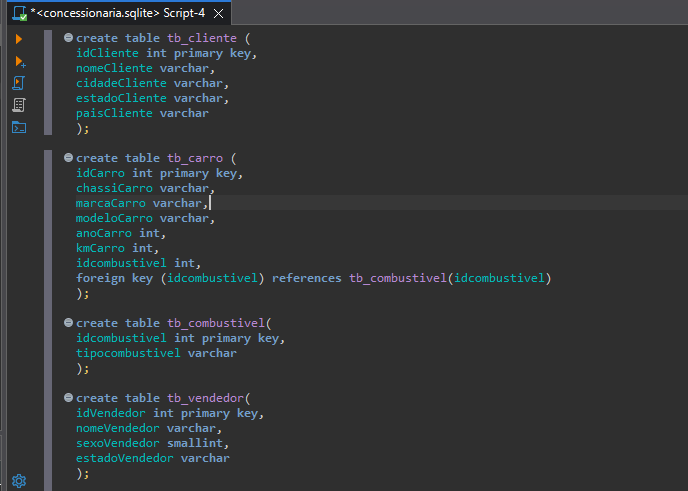
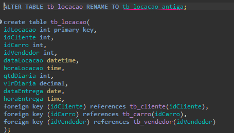
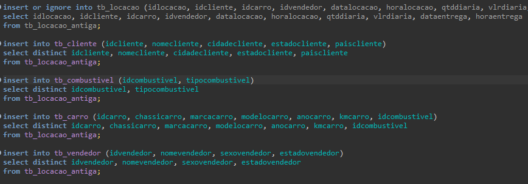
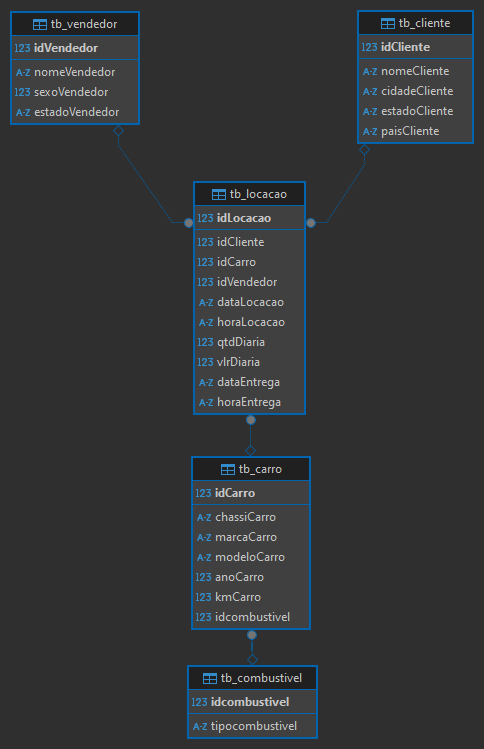
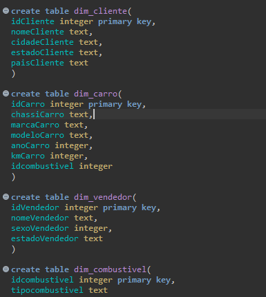
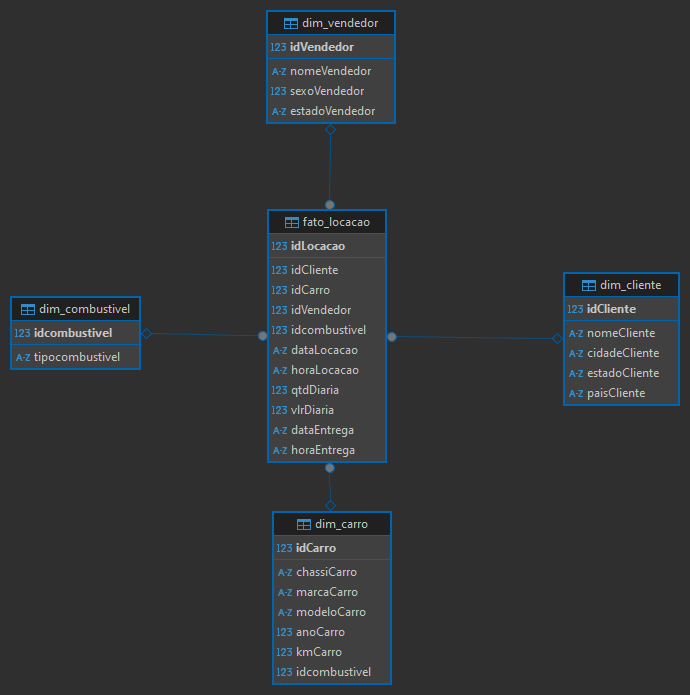

# Desafio da Sprint 1
## Caso de Estudo "Concessionária"
### O que fazer?
#### Normalizar o Banco de Dados de estudo
Primeiramente, notei que todas as colunas estavam concentradas em uma só tabela, o que dificulta a visualização e compreensão do objetivo do banco.

---
O **primeiro passo**, então, foi dividir essas colunas amontoadas em tabelas separadas e mais organizadas, onde "nomeCliente, estadoCliente" passaram a ser contidas na nova tabela "tb_cliente" e assim por diante.

 
A criação das chaves primárias vão servir mais tarde para serem utilizadas nas chaves estrangeiras e conectar essas colunas novas com a chave primária, e visualizar essas conexões quando criar as modelagens. 
 
---
O **segundo passo** foi mudar o nome da tabela antiga para tb_locacao_antiga, para evitar qualquer bug no momento de criar uma nova tb_locacao para migrar os antigos dados.

---
O **terceiro passo** foi usar os comandos INSERT para migrar os dados da antiga tabela para as tabelas novas. Assim, as colunas passariam a ter um mesmo conteúdo. E eu poderia apagar a tb_locacao_antiga.

Ao usar o IGNORE, as tabelas já existentes não teriam seu valor mudado.
E, agora, usei o próprio recurso do DBeaver para criar a Modelagem Relacional.

#### Criar o desenho da Modelagem Relacional

---
#### Criar o desenho da Modelagem Dimensional
O **quarto** e último passo, seria criar as tabelas dimensionais e a tabela fato, para poder simular a Modelagem Dimensional no DBeaver, usando o mesmo recurso usado para a Modelagem Relacional anterior.

---
Assim, pude simular a Modelagem Dimensional
