# Desafio Sprint 02
## Caso de estudo "Google Play Store"
## O que fazer?
### Passo 1:
Baixando o arquivo "googleplaystore.csv", pude acessar aos dados contidos nele: Aplicativos da Play Store, contendo informações como, número de instalações, categorias, avaliações, etc.

---
### Passo 2: Lendo o arquivo
De início, tive muitos problemas ao importar as bibliotecas Pandas e MatPlotLib, pois tive problemas severos com o *path* (caminho) dos diretórios. Mas ao restaurar o kernel e insistir no terminal de comando da minha máquina, com os comandos 'pip --install', consegui me livrar do problema e agora poderia usar os comandos.
    
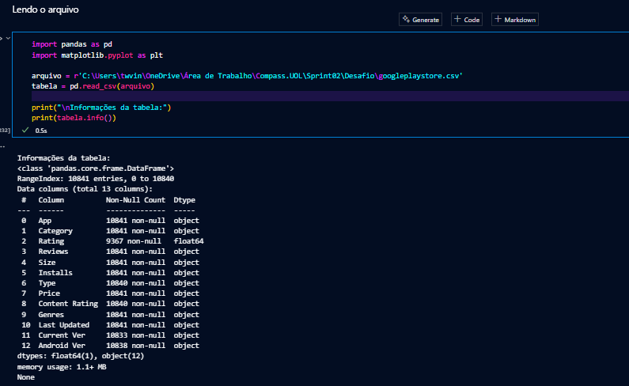

Também usei essa célula para acessar as informações da tabela e saber os nomes de cada coluna.

---
### Passo 3: Removendo linhas duplicadas.
Nomeei o *dataframe* como "linhas_unicas", daí em diante, sempre que quiser acessar as tabelas e colunas, basta eu usar essa variável.

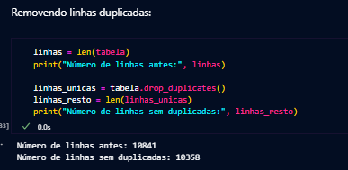

---
### Passo 4: Gráfico de Barras
A partir de agora, a biblioteca MatPlotLib passa a ser usada, para "plotar" os gráficos pedidos. 

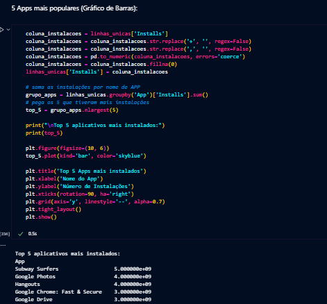

Primeiramente, busquei a coluna "Installs" e tive certeza de que o conteúdo fosse um número, com o comando do Pandas "pd.to_numeric", então somei as instalações por nome e separei os 5 maiores números.

Plotei o gráfico, tomando cuidado para que fosse legível, como por exemplo, rotacionando as palavras do eixo X em 90 graus, para que nenhuma sobrepusesse a outra. O gráfico gerado foi o seguinte:

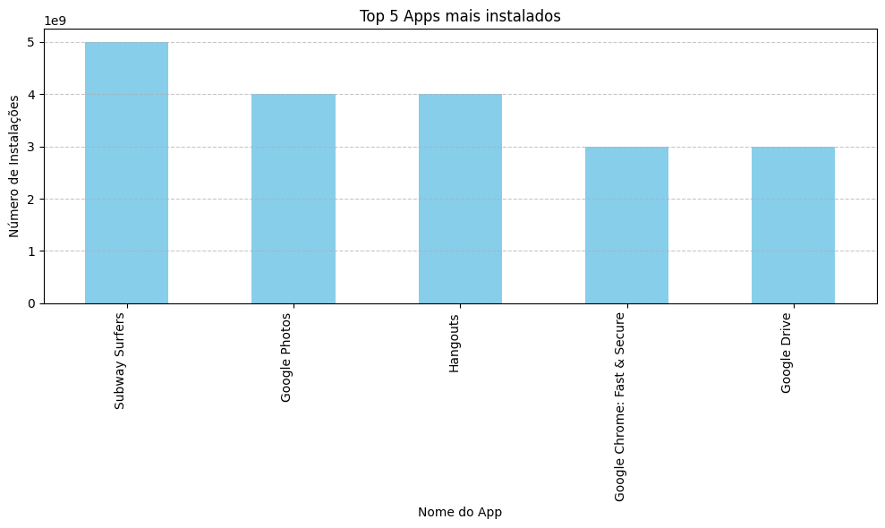

Percebe-se que esses são os cinco aplicativos mais instalados, na casa do bilhão.

---
### Passo 5: Gráfico de Pizza

Primeiramente, peguei os nomes das categorias e as separei nas 15 mais comuns (as 15 com maiores numeros de aplicativos). Decidi usar apenas 15, pois ao usar todas, o gráfico ficava ilegível, com nomes sobrepondo outros. 
Assim, qualquer outra categoria fora dessas 15, seriam rotuladas como OTHERS (Outros).

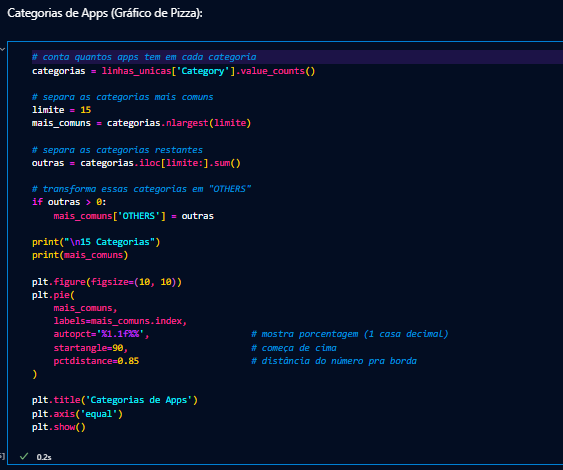

Depois de plotado o gráfico, o resultado foi o seguinte:

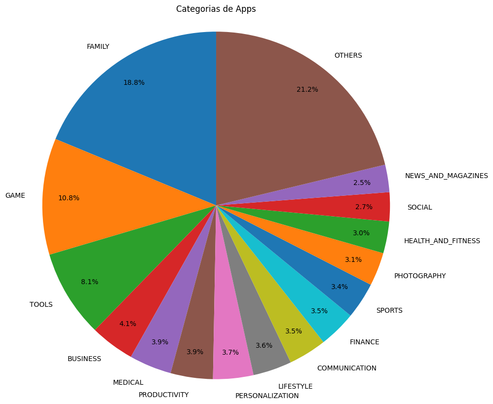

---
### Passo 6: O App Mais Caro do Dataset
Para pegar o valor correspondente ao aplicativo mais caro do arquivo, primeiro garanti que seria um valor número, e que qualquer preço que fosse um valor não numérico, por exemplo: "Grátis", se tornasse 0.
Então, identifiquei a linha do maior valor com ".idxmax", e imprimi seu nome e valor, limitando o float a duas casas decimais (centavos).

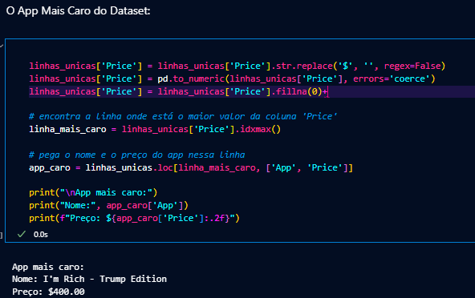

---
### Passo 7: A Quantidade de Aplicativos "Mature +17"
Para esse passo, filtrei a tabela, contei quantos Apps haviam, e imprimi o valor.

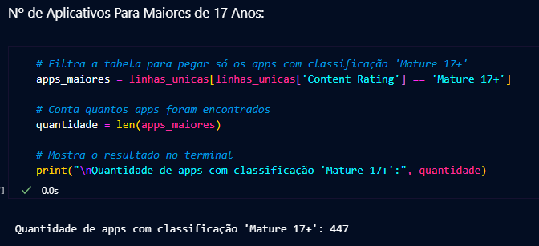

---
## Passo 8: 10 Apps Com Melhor Avaliação
Nesse passo, tive alguns problemas com os valores das avaliações. Por algum motivo, alguns Apps tinham uma avaliação maior que 5.0.
Por isso, filtrei para que só os Apps de até 5.0 de avaliação fossem mostrados, valor esse que é o máximo para avaliar um aplicativo.

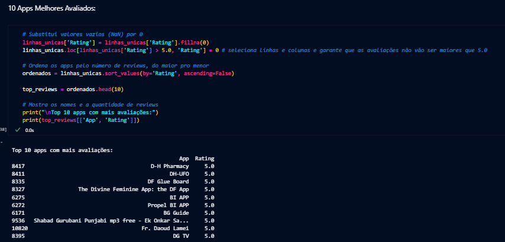

---
### Passo 9: Dois Novos Cálculos Sobre o Dataset
Precisando fazer dois novos cálculos quaisquer sobre o conteúdo do arquivo, sendo o primeiro em forma de linha e o segundo um valor único, decidi calcular os 5 Apps com pior avaliação (0.0), e depois calcular a média do valor de todos os Apps pagos.

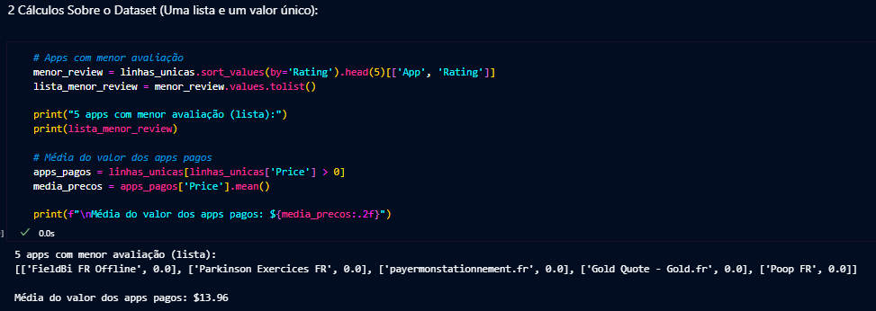

---
### Passo 10: Dois Novos Gráficos Sobre o Dataset
Parecido com o passo anterior, agora é preciso usar as funções do MatPlotLib para criar outros gráficos quaisquer.
Com ajuda de IA, decidi por fazer um gráfico de linha sobre a média de preço para cada categoria, de forma que ficasse o mais legível possível. Além de um histograma das avaliações dos aplicativos.

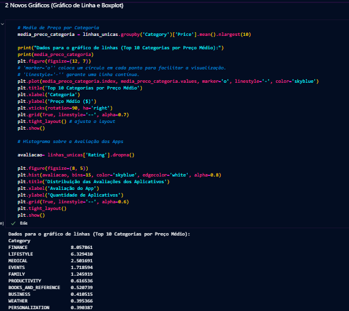

Para o gráfico de linha, organizei os aplicativos por categoria e os respectivos preços, utilizando o "groupby". Calculei o valor médio com "mean()" e selecionei apenas os 10 maiores valores.
Assim, pude plotar o gráfico o mais legível possível, com algumas funções que não conhecia, como por exemplo o "marker='o'" para facilitar a visualização dos pontos de um gráfico.

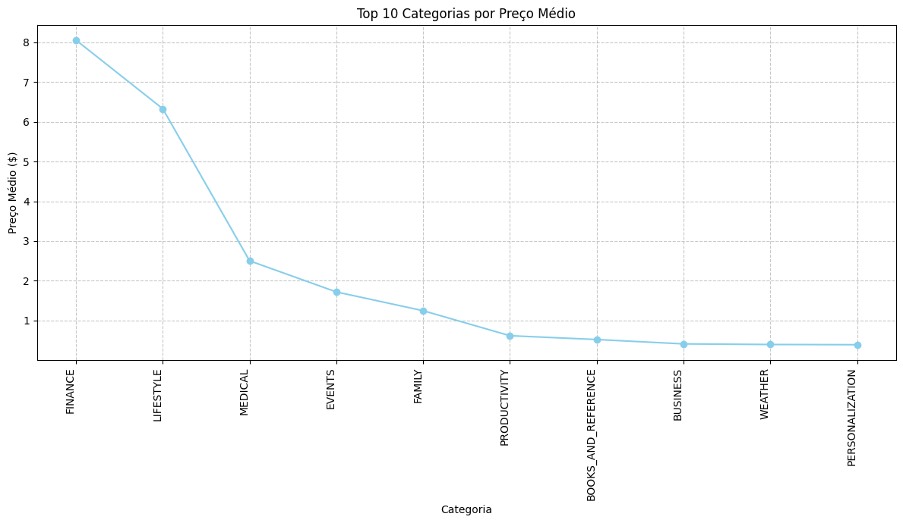

---
Já para o gráfico histograma, removi possíveis valores ausentes das avaliações dos Apps e plotei o gráfico a seguir:

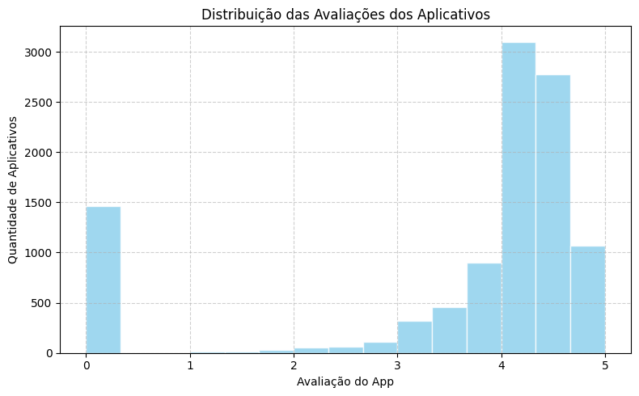

---
Todo o código foi feito em um arquivo .ipynb, com a extensão do Jupyter para Visual Studio Code. Com essa extensão, posso programar como Notebook, de forma que cada código mostrado acima foi dividido em células e separados com Markdown.