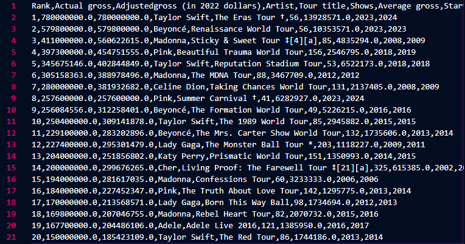
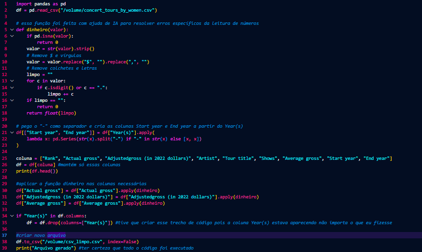
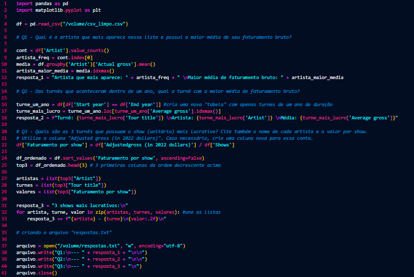
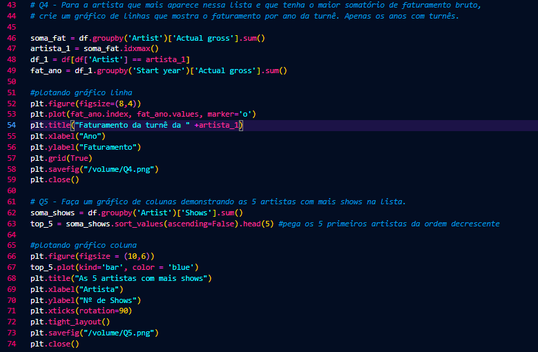
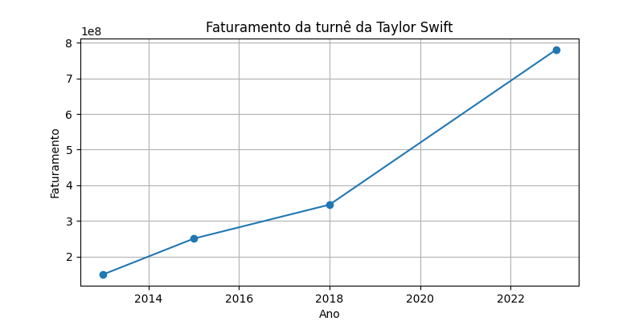
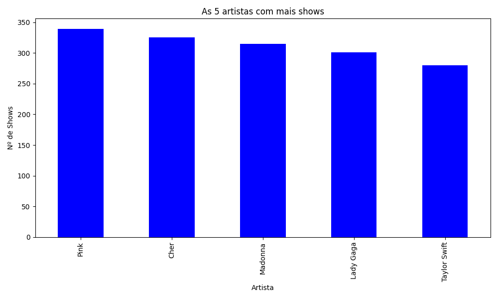
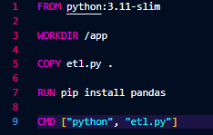
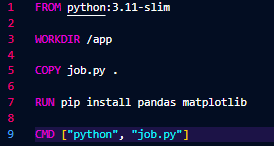
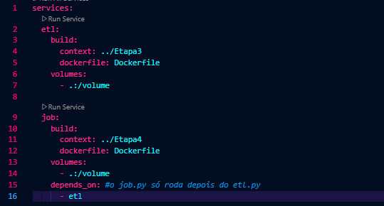
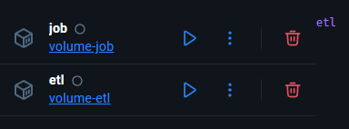

# Desafio Sprint 03
## Caso de estudo: "Tours das Artistas"
### O que fazer?
---
### Passo 1:

Primeiramente, baixei o arquivo "concert_tours_by_women.csv" e limpei e reorganizei seus dados, de modo a ficar exatamente da maneira em que foi exigido nas orientações.

Para gerar o arquivo, tive de criar o "etl.py" para ler o arquivo e realizar os comandos necessários pra limpá-lo. 

---
Tive ajuda de IA para pensar na função que limpasse os valores em dinheiro de determinadas colunas, como por exemplo, remover os cifrões e as vírgulas para que ficasse conforme o exigido, e em seguida apliquei nas colunas necessárias. 

Além disso, pude perceber que as colunas "Start year" e "End year" não existiam no .csv original, e ao conversar com meu squad, notei que deveria então criar essas novas colunas a partir da coluna "Year(s)" que separava as datas com hífen (2023-2024) indicando o início e o fim daquela tour. 

Usei lambda e pd.Series do pandas para separar a coluna Year(s) em duas colunas, usando o .split() como separador, e, caso o valor fosse apenas um, sem hífen, separar em duas colunas o mesmo valor, indicado que a tour começou em 2024 e terminou também em 2024.

---
### Passo 2: 

A próxima etapa do desafio seria agora criar o "job.py", aplicação que respondesse a algumas perguntas e gerasse gráficos agora utilizando o novo .csv gerado na etapa anterior.

---
Criei as respostas das 3 primeiras perguntas e a partir delas criei o arquivo de texto "respostas.txt" conforme pedido.

As duas últimas perguntas então, que deveriam apresentar também os gráficos gerados em sua resposta:

Usando matplotlib, plotei os gráficos necessários e os salvei diretamente na máquina.

---

---
### Passo 3:

O próximo passo, então, seria criar os Dockerfiles que rodassem os scripts "etl.py" e "job.py" em seu container. Então, separei em pastas Etapa 3 e Etapa 4, conforme dispostas na Udemy, e criei o Dockerfile em sua respectiva pasta, equivalente ao .py a ser executado pelo container. 

---
Basicamente, o Dockerfile copia seus respectivos .py para a pasta /app (que só existe dentro do container, o nome app é uma boa prática), instala as bibliotecas necessárias, e então roda o comando.

---
### Passo 4:

Com os Dockerfiles criados, eu deveria criar o docker-compose.yml, que vai unir esses dois containeres (volume) criados anteriormente, contendo o "etl.py" e o "job.py" e rodar os dois scripts, compartilhando seus dados entre si.

---
Cada serviço (etl, job) é um container que será criado, que serão construídos (build) a partir de um Dockerfile, gerando uma nova imagem. Para "buildar" esses containeres, o Docker vai procurar os arquivos necessários (context), por exemplo, o etl.py precisa acessar o arquivo "concert_tours_by_women.csv" para executar a aplicação. Por fim, é criado o volume, utilizando o diretório informado em "volumes", então esses arquivos vão estar acessíveis no caminho /volume.

---
Na pasta /volume, serão gerados então todos os arquivos que o "etl.py" e "job.py" entregam ao fim da aplicação, como por exemplo os gráficos, o .csv limpo, e o texto das respostas.