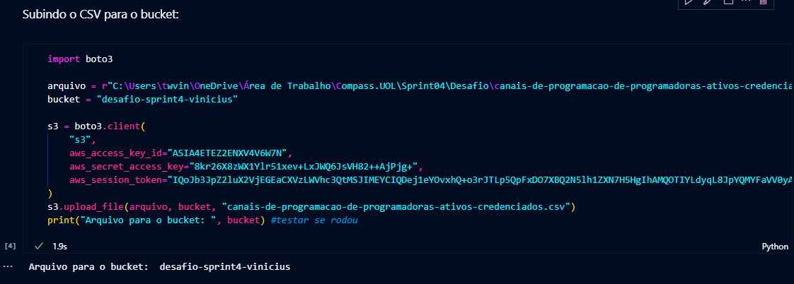
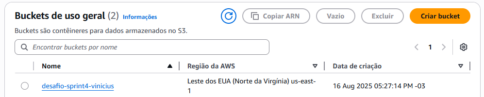
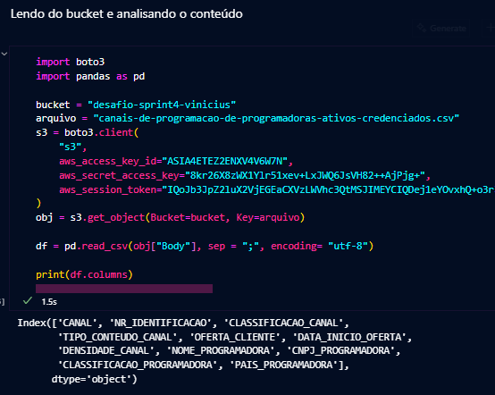
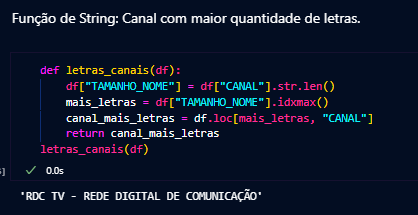
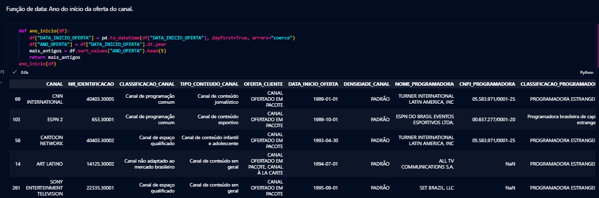
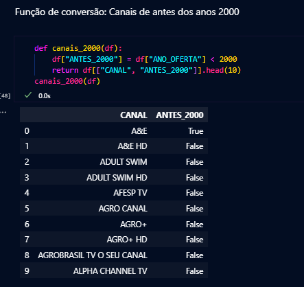
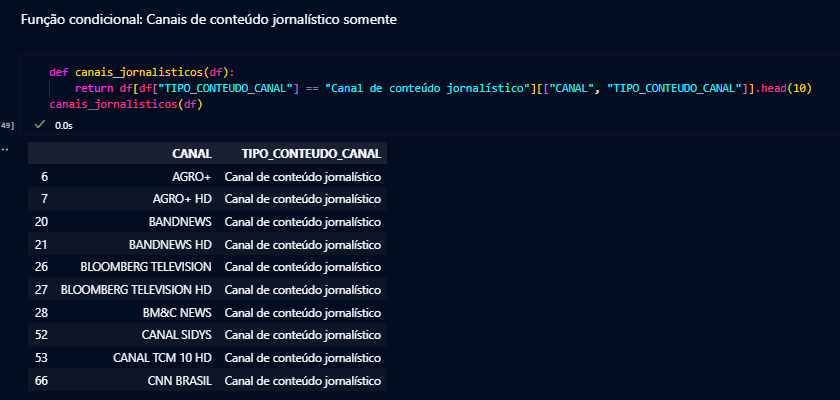
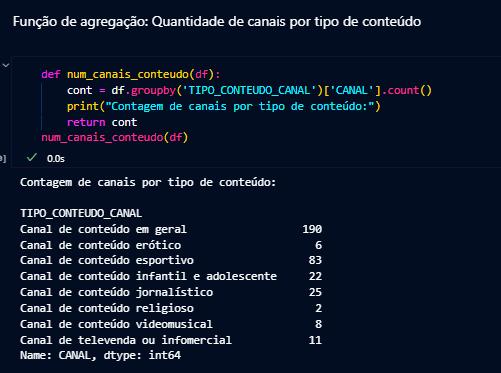
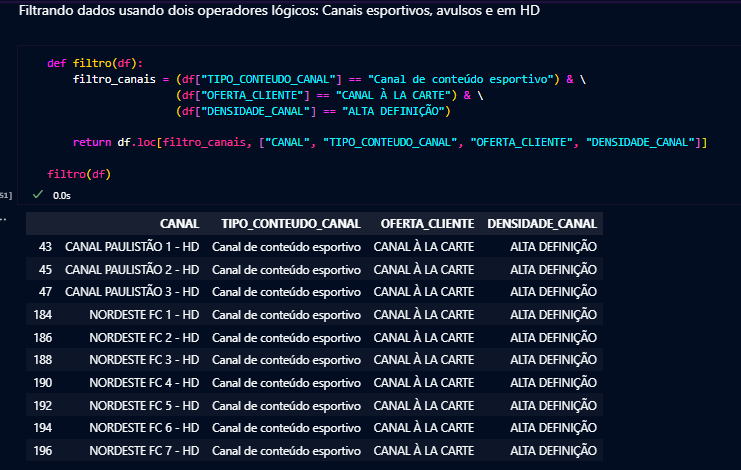

# Desafio Sprint 4
## Passo a Passo
### Caso de estudo: dataset do governo.
#### Passo 1: Carregar o arquivo para o S3.

Primeiramente, acessei o site do governo e escolhi um arquivo .csv, conforme orientado no guia do desafio.
Escolhi então o arquivo "canais-de-programacao-de-programadoras-ativos-credenciados.csv", que lista canais de pacote de televisão licenciados pela ANCINE.

Nesse quesito, tive problemas quando fui utilizar o boto3, pois ele não tinha acesso às minhas credenciais da AWS. Depois de muito tentar pelo prompt de comando, pesquisando, achei essa alternativa, de informar dentro do "boto3.client", que cria um <i>low-level client.</i> É uma prática contra-indicada, pois essas credenciais são visíveis no código, mas, para fins de correção, julguei não ter problema.

Resolvido isso, pude então realizar o upload do arquivo para um bucket que eu já havia criado previamente no Amazon S3.

---
#### Passo 2: Analisar o dataset diretamente do bucket criado.

Em seguida, em outro script .ipynb, deveria pegar esse arquivo diretamente do bucket e analisar, seguindo algumas exigências especificadas no Udemy. Usando a função .get_object() do boto3, é possível ler o arquivo em questão do bucket.

Imprimindo as colunas para consulta mais eficiente no futuro.

---
Como função de String, decidi por procurar o canal com maior quantidade de letras do dataset. Criei uma tabela nova chamada TAMANHO_NOME (seguindo o mesmo padrão dos nomes das tabelas ja existentes) a partir da tabela CANAL, de acordo com o tamanho de cada String nela.

---
Na função de data, criei uma nova tabela a partir da tabela já existente DATA_INICIO_OFERTA, que informa o ano em que o canal passou a ser ofertado no pacote. A nova tabela criada obtém apenas o ano desta data (dt.year), e a função lista os 5 canais mais antigos do pacote.

---
A função de conversão, na verdade, apenas cria uma nova tabela (ANTES_2000) a partir da tabela criada na função anterior, para acessar somente os canais que tenham tido início antes dos anos 2000. Os 10 primeiros (em ordem alfabética) foram listados na saída. <b>(A conversão foi realizada na função anterior, transformando a data informada na tabela em DATETIME, essa função apenas trabalha a partir dessa conversão.)</b>

---
Na função condicional, não usei um "if", mas declarei a condição dentro do próprio return, transformando a instrução numa só linha. A tabela "TIPO_CONTEUDO_CANAL" do dataset, informa qual é o gênero daquele canal, se ele é de conteúdo geral, se ele é esportivo, jornalístico. A partir dessa informação, usei a condição de que o conteúdo dessa tabela fosse, de acordo os padrões do próprio dataset, "Canal de conteúdo jornalístico". Assim, listei 10 canais jornalísticos presentes no CSV.

---
Na função de agregação, usando o groupby() e count(), contabilizei quantos canais de cada tipo de conteúdo existem no dataset. Agrupei as colunas TIPO_CONTEUDO_CANAL e CANAL, e determinei o count() de quantas vezes cada conteúdo aparece nos canais.

---
Por último, a cláusula que filtrasse dados usando dois operadores lógicos, nesse caso, usei dois "&". Listei todos os canais que fossem de conteúdo esportivo, à la carte(não incluso no pacote) e que também fossem HD (Alta definição). Então retornei as tabelas "CANAL", "TIPO_CONTEUDO_CANAL", "OFERTA_CLIENTE" (determina se o canal é ofertado no pacote ou se é avulso) e "DENSIDADE_CANAL" (que se refere a qualidade/resolução da imagem daquele canal, podendo ser "Padrão" ou "ALTA DEFINIÇÃO").
