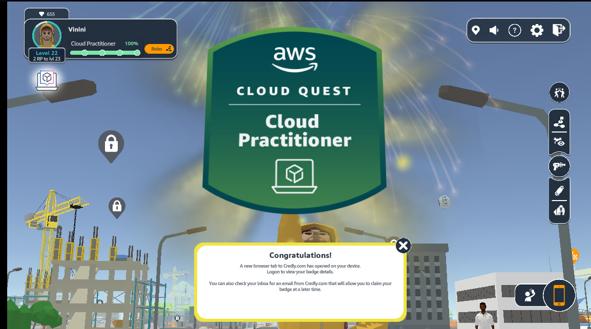
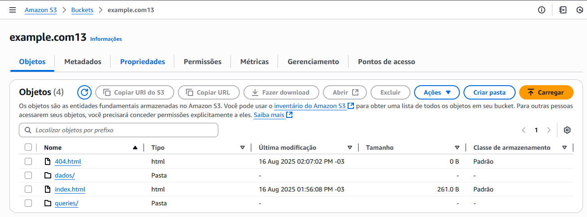
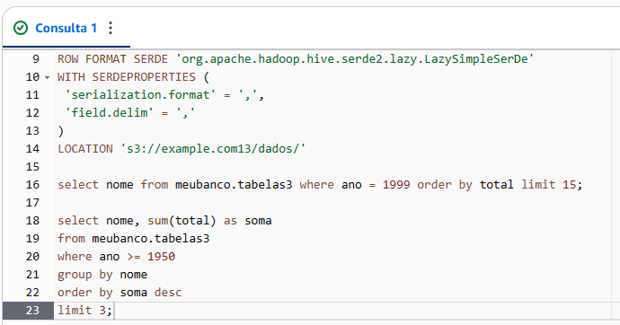
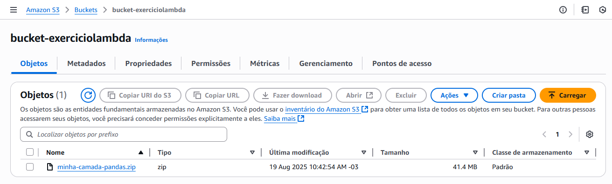
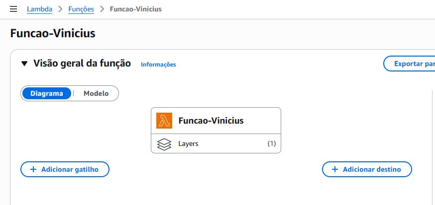
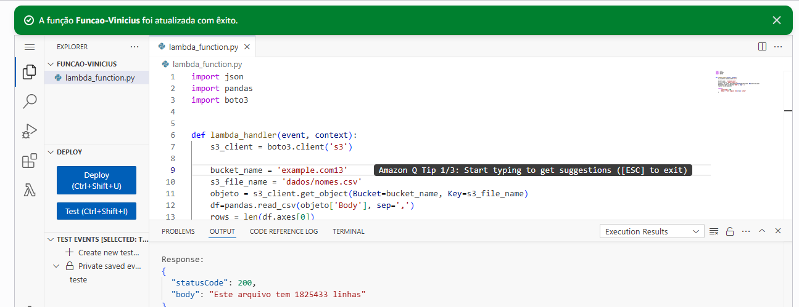

# Resumo da Sprint 4
## O que aprendi?
A Sprint 4 foi mais tranquila em relação às outras, com cursos densos, conteudistas, mas menos trabalhosos. O desafio foi muito claro e os exercícios fáceis de acompanhar.

---
## Primeira Semana:
Na primeira semana, nos foi designados alguns cursos no AWS SkillBuilder, sobre os serviços do AWS em geral. Esses cursos foram bem densos, com muita leitura e termos para se aprender sobre, com avaliações para certificado no fim de cada um deles.

## Segunda Semana:
Já na segunda semana, tivemos mais exemplos práticos sobre esse conteúdo dos cursos do AWS, dentro do jogo AWS Cloud Quest, que, na minha opinião, ensina de maneira dinâmica e menos maçante que as aulas dos demais cursos. <b>Cada conclusão de exercício está salva na pasta Evidências, com o tempo de conclusão de cada laboratório que foi usado.</b>

---

Quanto a isso, esse exercício em específico "Databases in Practice", apresenta apenas 38 segundos na conclusão do laboratório. Isso porque, em algum momento a aba teve que ser recarregada, zerando assim o tempo em que estive trabalhando nela.

Por isso mesmo, printei também a tela da simulação do Cloud Quest, onde esse laboratório foi utilizado, mostrando, no canto inferior direito, a real quantidade de tempo restante ao final do exercício.

---
O AWS Cloud Quest foi, de fato, bem mais produtivo para mim, onde aprendi de maneira mais clara cada conceito e cada função dos serviços AWS, pois o conteúdo é dado de forma divertida e dinâmica, como mencionei acima.

- [Badge de Conclusão do AWS Cloud Quest](../Sprint04/Evidências/Link%20da%20Badge%20do%20AWS%20Cloud%20Quest.txt)

---
Após concluídos os cursos, chegou a hora dos exercícios e do desafio.

Criado o primeiro bucket, deveria ser feito o upload do arquivo nomes.csv para dentro da pasta "dados/" e também definidos o index.html e o 404.html.

A partir desse bucket e desse .csv, deveria ser então efetuado o passo a passo do AWS Athena, acessando esse .csv e realizando alguns exercícios com esse dataset.

---
O próximo exercício foi no AWS Lambda, onde deveria ser criado um bucket e com o Docker e comandos Linux, criada uma pasta com a biblioteca Pandas.

---
Para isso, precisei criar uma função de Lambda e adicionar uma camada chamada PandasLayer, para que o Lambda pudesse ter acesso à biblioteca e conseguir executar o código a seguir.

---
<b>Nada foi adicionado à pasta Exercícios, pois o exercício foi adicionado em prints na pasta Evidências.</b>

- [Pasta Evidências](../Sprint04/Evidências/)
- [Pasta Desafio](../Sprint04/Desafio/)
- [README Desafio](../Sprint04/Desafio/README.md)