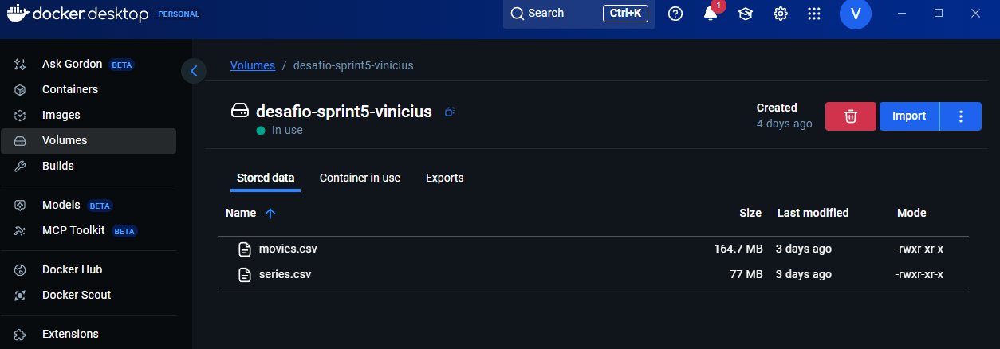
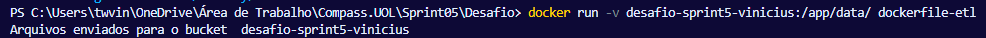
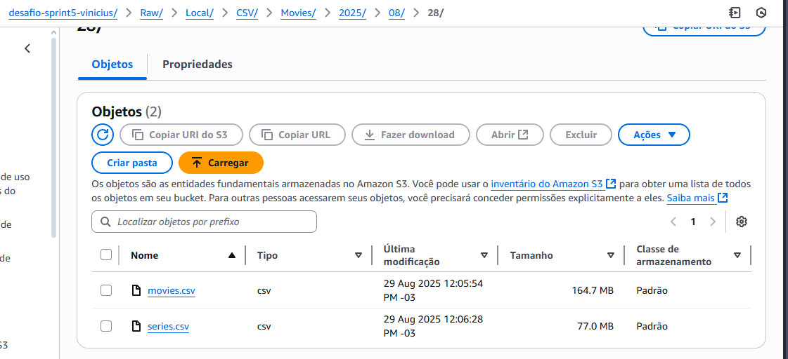
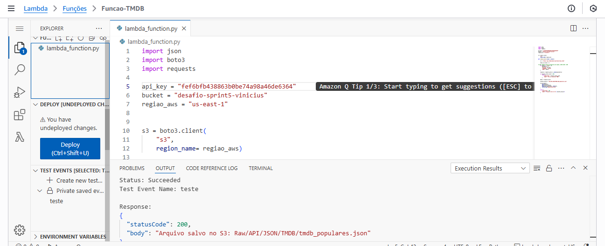
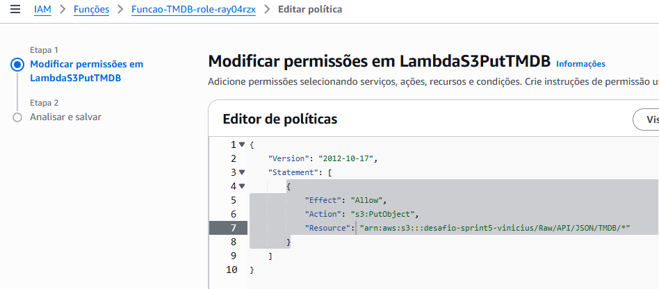
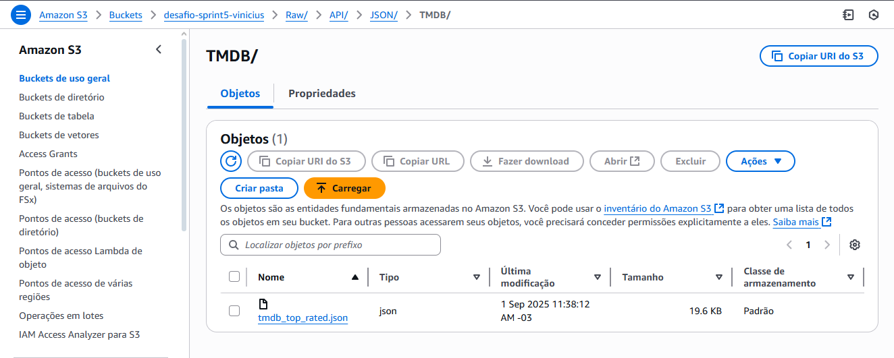
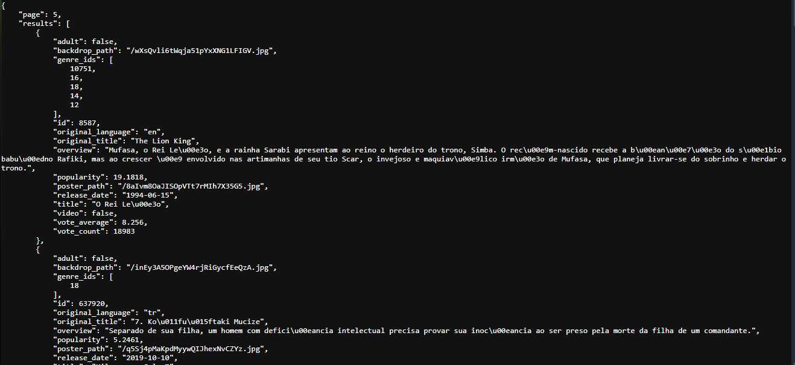

# Desafio Sprint 5
## O que será analisado no desafio?
### Ação/Aventura
- O quanto um período de guerra pode impactar na produção de filmes?
- Qual as notas de filmes dessa época? (Primeira Guerra Mundial)
- Agora, num contexto geral, qual a diferença de gênero na indústria de cinema?

## Passo a passo da execução do desafio
### Passo 1: 
Primeiramente, deveria ser instalado os arquivos movies.csv e series.csv, analisá-lo, e usar a biblioteca boto3 em Python para realizar o upload desses arquivos para um bucket no Amazon S3.
    import boto3

    arquivo1 = "/app/data/movies.csv"
    arquivo2 = "/app/data/series.csv"
    bucket = "desafio-sprint5-vinicius"

    s3 = boto3.client(
        "s3",
        aws_access_key_id = "xxxxx",
        aws_secret_access_key = "xxxxx",
        aws_session_token = "xxxxx"
    )

    s3.upload_file(arquivo1, bucket, "desafio-sprint5-vinicius/Raw/Local/CSV/Movies/2025/08/28/movies.csv")
    s3.upload_file(arquivo2, bucket, "desafio-sprint5-vinicius/Raw/Local/CSV/Series/2025/08/28/series.csv")

    print("Arquivos enviados para o bucket ", bucket) # teste

Utilizei um volume do Docker para armazenar esses arquivos e rodar o script dentro do container.
    
    FROM python:3.11-slim

    WORKDIR /app

    COPY ETL.py .

    RUN pip install boto3

    VOLUME /app/data

    CMD ["python","ETL.py"]
 ---

---
Usando esses comandos no "docker run", o volume é criado e lhe é atribuído o conteiner criado anteriormente.

---

---
### Passo 2: 
Tendo analisado os .csv e refletido sobre as análises a serem feitas futuramente, passei a analisar as APIs do The Movie DataBase (TMDB), e, tendo em mente o tipo de estudo que decidi fazer, comparando a popularidade e as notas de filmes mais antigos, onde não haviam serviços de streaming, com filmes recentes, que com esses serviços, conseguem ter maior acesso.

Para isso, decidi por usar o endpoint "top_rated", para acessar os filmes melhores avaliados para no futuro comparar as suas datas de lançamento.

Depois disso, deveria ser utilizado o AWS Lambda para executar o código que realizaria o upload dessa API no formato JSON para o bucket do S3.

    import json
    import boto3
    import requests

    api_key = "xxxxx"
    bucket = "desafio-sprint5-vinicius"
    regiao_aws = "us-east-1"

    s3 = boto3.client(
    "s3", 
    region_name= regiao_aws)

    def lambda_handler(event, context):

        url = "https://api.themoviedb.org/3/movie/top_rated"

        todos_os_filmes = []

        # cada chamado aceita 20 registros por página, então 5x20 = 100
    
        for pagina in range(1, 6):
            parametros = {
            "api_key": api_key,
            "language": "pt-BR",
            "page": pagina
    }

    resposta = requests.get(url, params=parametros)

    if resposta.status_code != 200:
        return {
            "statusCode": resposta.status_code,
            "body": "Erro ao consultar TMDB"
        }

    dados = resposta.json()

    caminho_arquivo = "Raw/API/JSON/TMDB/tmdb_top_rated.json"

    s3.put_object(
        Bucket=bucket,
        Key=caminho_arquivo,
        Body=json.dumps(dados, indent=4),
        ContentType="application/json"
    )

    return {
        "statusCode": 200,
        "body": f"Arquivo salvo no S3: {caminho_arquivo}"
    }

---
Procurei testar o script o máximo possível antes de executar ele no AWS Lambda, para evitar gerar custos desnecessários.

Antes de executar, pesquisei e descobri que o Lambda comporta a boto3 por padrão, mas não comporta o "requests". Por isso, tive que usar o CMD para criar uma pasta python dentro de uma pasta .zip, e realizar o pip install dentro dela para que pudesse criar uma camada/layer dentro do Lambda, para que a função tivesse acesso aos recursos necessários.

Além disso, tive que acessar a categoria Funções do IAM no AWS, para conceder a permissão para o código realizar o "put_object", criando uma política em linha.

---
Com essas questões resolvidas, o código rodou sem problemas, como no print um pouco acima, e realizou o upload do JSON no bucket.

