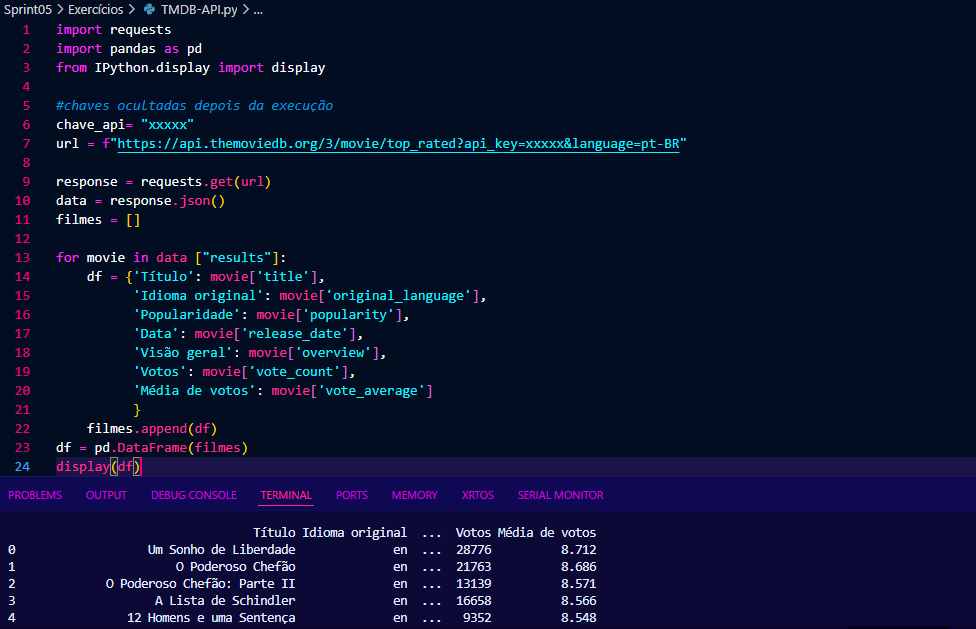

# Resumo da Sprint 5
## O que aprendi?
Na sprint 5, foi estudado o Apache Spark e um pouco do Apache Hadoop, mas foi trabalhado em exercícios o PySpark.

---
## Exercícios realizados

O primeiro exercício foi proposto nos slides de Apache Hadoop e Apache Spark. Se trata de um exercício de implementação do Spark, com passo a passo e exemplos de códigos já prontos.

Nele seria criado um dataframe, utilizando as funções sql do Pyspark, como StructType e StructField, e em seguida o analisando, criando colunas novas a partir de métodos diferentes.

- [Exercício em questão](./Exercícios/HelloWorld.ipynb)

---
O segundo exercício, era criar um contador de palavras para ler um README (entendi que seria o README do próprio repositório do PySpark no Github), e contar a quantidade de cada palavra presente no arquivo.

    import os
    from pyspark.sql import SparkSession

    spark = SparkSession.builder.appName("ContadorPalavras").getOrCreate()
    sc = spark.sparkContext

    #Lendo o README do repositório do Spark no Github:
    os.system("wget https://raw.githubusercontent.com/apache/spark/master/README.md")

    arquivo = sc.textFile("README.md")
    contagem = arquivo.flatMap(lambda line: line.split()).map(lambda word: (word, 1)).reduceByKey(lambda a, b: a + b)
    contagem.collect()

    print("Quantidade de palavras: ")
    for(word, count) in contagem.collect():
        print(f"{word}: {count}")
---
Deveria ser criado um conteiner Docker para ser utilizado o Spark Shell.

---
Usando "docker exec", foi iniciado o pyspark dentro do conteiner (Spark Shell).

---
Então, esse código foi executado dentro do conteiner no próprio CMD, linha por linha.

---
Por último, o exercício relacionado à API do TMDB, usando Pandas, criando novas colunas a partir das colunas existentes na API e exibindo a tabela.

    import requests
    import pandas as pd
    from IPython.display import display

    #chaves ocultadas depois da execução
    chave_api= "xxxxx"
    url = f"https://api.themoviedb.org/3/movie/top_rated?api_key=xxxxx&language=pt-BR"

    response = requests.get(url)
    data = response.json()
    filmes = []

    for movie in data ["results"]:
        df = {'Título': movie['title'],
            'Idioma original': movie['original_language'],
            'Popularidade': movie['popularity'],
            'Data': movie['release_date'],
            'Visão geral': movie['overview'],
            'Votos': movie['vote_count'],
            'Média de votos': movie['vote_average']
            }
        filmes.append(df)
    df = pd.DataFrame(filmes)
    display(df)

---

---
## Desafio da Sprint
Tive bastante problema em compreender o que de fato deveria ser feito e entregue nesse desafio, pois parte das orientações retratava sobre etapas futuras, visto que esse desafio da sprint 5 se trata da primeira parte de um projeto maior. No fim das contas, conversei com colegas de trilha e entendi o que deveria ser entregue. 

Pessoalmente, foi bem mais desafiador pensar em análises a serem feitas dos .csv e da API do TMDB, do que de fato implementar os códigos e serviços da AWS. Foi interessante o uso da AWS ao decorrer do desafio, usando Funções do Lambda e buckets do S3.

- [Pasta Desafio](./Desafio/)
- [README do Desafio](./Desafio/README.md)
- [Pasta Evidências](./Evidências/)