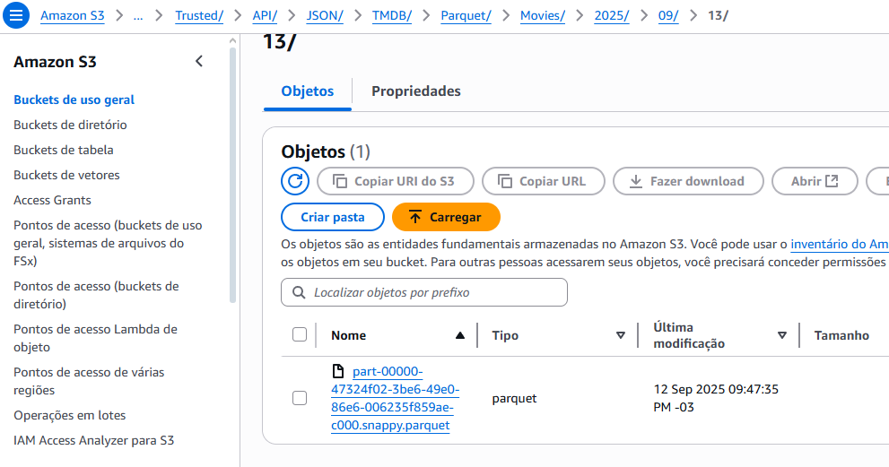

# Resumo do Desafio
## Passo a Passo:
Esse desafio é ainda parte do projeto final de Filmes e Séries, onde deveria ser feito a conversão dos arquivos csv em Parquet, além de tratados os registros a serem utilizados, no meu caso, limitei até 100 registros novamente, e utilizei apenas os gêneros atribuídos ao meu squad, no caso, Ação e Aventura.
Os arquivos em Parquet deveriam ser armazenados numa camada Trusted, que diferente da camada Raw(bruto), significa que nela estão contidos arquivos já tratados e confiáveis.

---
Abaixo o código executado pelo Glue, transformando o CSV em Parquet e armazenando-o.

    import sys
    from awsglue.transforms import *
    from awsglue.utils import getResolvedOptions
    from pyspark.context import SparkContext
    from awsglue.context import GlueContext
    from awsglue.job import Job
    from datetime import datetime
    from pyspark.sql.functions import col, lower

    args = getResolvedOptions(sys.argv, ['JOB_NAME', 'S3_INPUT_PATH'])

    sc = SparkContext()
    glueContext = GlueContext(sc)
    spark = glueContext.spark_session
    job = Job(glueContext)
    job.init(args['JOB_NAME'], args)

    # lendo os dados csv
    df = glueContext.create_dynamic_frame.from_options(
        connection_type="s3",
        connection_options={"paths": [args['S3_INPUT_PATH']]},
        format="csv",
        format_options={"withHeader": True, "separator": "|"}
    )

    #filtrando os gêneros a serem usados
    df_filtrado = Filter.apply(
        frame=df,
        f=lambda x: 
            'genero' in x and 
            x['genero'] is not None and 
            ('action' in x['genero'].lower() or 
            'adventure' in x['genero'].lower())
    )
    #limitando os registros a 100, convertendo o DynamicFrame para dataframe temporariamente pra usar a função .limit()
    if df_filtrado.count() > 0:
        spark_df = df_filtrado.toDF().limit(100)
        df_definitivo = glueContext.create_dynamic_frame.from_rdd(spark_df.rdd, spark_df.schema)
    else:
        df_definitivo = df_filtrado

    #data de hoje para particionar
    data_hoje = datetime.now()
    ano = data_hoje.strftime('%Y')
    mes = data_hoje.strftime('%m')
    dia = data_hoje.strftime('%d')

    s3_output_path = f"s3://desafio-sprint6-vinicius/Trusted/Local/CSV/Parquet/Movies/{ano}/{mes}/{dia}/"

    # escrevendo o parquet no bucket
    glueContext.write_dynamic_frame.from_options(
        frame=df_definitivo,
        connection_type="s3",
        connection_options={"path": s3_output_path},
        format="parquet"
    )
    job.commit()

### JSON em Parquet
Em seguida, o JSON da API do TMDB deveria passar pelo mesmo processo. Mas, é um pouco mais complicado de ser feito, já que o JSON possui uma estrutura diferente de dados, não em colunas. Para isso, pesquisei sobre a função 'explode' que transforma um array dentro de um array em uma lista simples, separada por vírgula. Utilizei também o auxílio de IAs.

    import sys
    from awsglue.transforms import *
    from awsglue.utils import getResolvedOptions
    from pyspark.context import SparkContext
    from awsglue.context import GlueContext
    from awsglue.job import Job
    from datetime import datetime
    from pyspark.sql.functions import array_contains
    from pyspark.sql.functions import explode

    args = getResolvedOptions(sys.argv, ["JOB_NAME", "S3_INPUT_PATH"])

    sc = SparkContext()
    glueContext = GlueContext(sc)
    spark = glueContext.spark_session
    job = Job(glueContext)
    job.init(args["JOB_NAME"], args)

    #lendo o JSON do bucket
    df = spark.read.option("multiline", "true").json(args["S3_INPUT_PATH"])

    #com ajuda de uma IA, utilizei a função 'explode', que muda os elementos de um array, separando-os por vírgula
    filmes_df = df.select(explode("results").alias("filme"))

    #extraindo colunas
    filmes_expandidos = filmes_df.select(
        "filme.adult",
        "filme.backdrop_path", 
        "filme.genre_ids",
        "filme.id",
        "filme.original_language",
        "filme.original_title",
        "filme.overview",
        "filme.popularity",
        "filme.poster_path",
        "filme.release_date",
        "filme.title",
        "filme.video",
        "filme.vote_average",
        "filme.vote_count"
    )

    #filtrando gêneros, na API do TMDB, os gêneros são divididos por IDs, sendo 28 = ação e 12 = aventura
    df_filtrado = filmes_expandidos.filter(
        array_contains(filmes_expandidos["genre_ids"], 28) | array_contains(filmes_expandidos["genre_ids"], 12)
    )

    #data de hoje para particionar
    data_hoje = datetime.now()
    ano = data_hoje.strftime('%Y')
    mes = data_hoje.strftime('%m')
    dia = data_hoje.strftime('%d')

    s3_output_path = f"s3://desafio-sprint6-vinicius/Trusted/API/JSON/TMDB/Parquet/Movies/{ano}/{mes}/{dia}/"

    df_filtrado.write.mode("overwrite").parquet(s3_output_path)

    job.commit()

Como comentado no próprio código, os gêneros de filmes também são tratados de forma diferente na API do TMDB. Isso porque, os gêneros são identificados em forma de ID, não explicitamente informados, como "Ação" ou "Terror". Para isso, acessei a API de gêneros do TMDB, para descobrir quais IDs se referiam aos gêneros que eu buscava. 

---
Com tudo isso feito, bastava executar os códigos (run job) de ETL e conferir se os Parquet foram criados e armazenados corretamente na camada Trusted.

O mesmo foi feito com o arquivo CSV, que ficou dentro da estrutura: "Trusted/Local/CSV/Parquet/Movies/{ano}/{mes}/{dia}/".