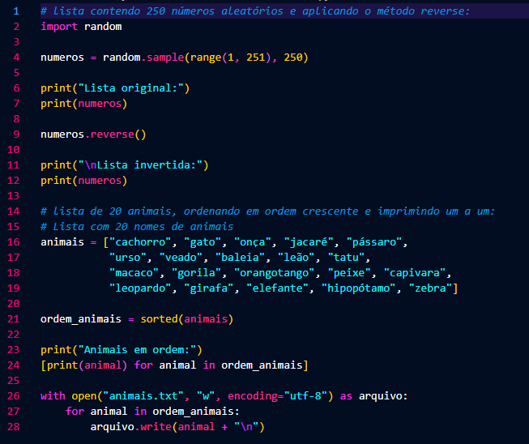
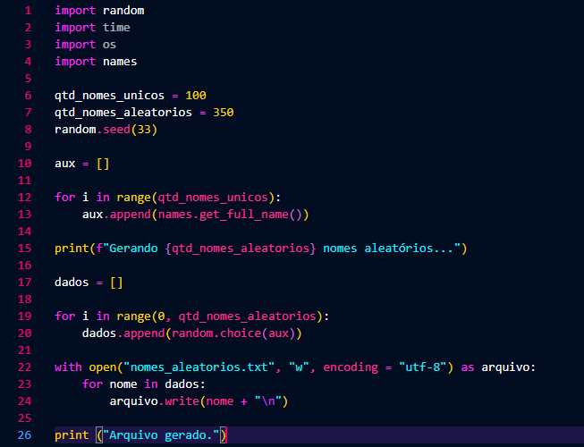

# Resumo da Sprint 6
## O que eu aprendi?

Nessa sprint, foi bastante trabalhado o AWS Glue, para extrair e tratar dados, um ETL, e armazená-los no S3. 

Na segunda semana, foram feitos alguns exercícios de AWS Glue e Spark. 

---
Nos exercícios de Spark, foi criada uma lista de 250 números inteiros, e depois aplicado o 'reverse' para inverter o conteúdo da lista. E, além disso, também foi criada uma lista de 20 animais e organizados em ordem crescente (no caso de Strings, ordem alfabética).

Ainda no exercício de Spark, foi feito um script que gerasse nomes aleatórios de pessoas e armazenasse em formato .txt para ser utilizado no próximo script de exercício.

---
Com o arquivo de texto criado, seria utilizado, finalmente, o Spark. Com isso, foi criada uma tabela e colunas novas em cima desses nomes aleatórios.

    from pyspark.sql import SparkSession
    from pyspark import SparkContext, SQLContext
    from pyspark.sql.functions import rand, when
    from pyspark.sql.functions import floor, col, array, lit

    spark = SparkSession.builder.master("local[*]").appName("Exercício Spark").getOrCreate()

    df_nomes = spark.read.csv(r"C:\Users\twvin\OneDrive\Área de Trabalho\nomes_aleatorios.txt", header= False)
    df_nomes = df_nomes.withColumnRenamed("_c0", "nome")

    df_nomes.printSchema()
    df_nomes.show(10, truncate= False)

    df_nomes = df_nomes.withColumn(
        "Escolaridade",
        when((rand() < 0.33), "Fundamental")
        .when((rand() < 0.66), "Medio")
        .otherwise("Superior")
    )

    pais = [
        "Brasil", "Bolívia", "Guiana", "Argentina", "Peru",
        "Suriname", "Uruguai", "Equador", "Guiana Francesa", "Paraguai",
        "Colômbia", "Chile", "Venezuela"
    ]

    pais_array = array([lit(p) for p in pais])

    df_nomes = df_nomes.withColumn(
        "Pais",
        pais_array[floor(rand() * len(pais))]
    )

    df_nomes = df_nomes.withColumn(
        "AnoNascimento",
        floor(rand() * (2010 - 1945 + 1) + 1945)
    )

    df_select = df_nomes.select("Nome", "AnoNascimento").where(df_nomes["AnoNascimento"] >= 2000)
    df_select.show(10, truncate=False)

    df_nomes.createOrReplaceTempView("Pessoas")

    df_select_sql = spark.sql("select Nome, AnoNascimento from Pessoas where AnoNascimento >= 2000")
    df_select_sql.show(10, truncate=False)

    df_millennials = df_nomes.filter(
        (col("AnoNascimento") >= 1980) & (col("AnoNascimento") <= 1994)
    )

    print("Número de 'millennials': ", df_millennials.count())

    df_nomes.createOrReplaceTempView("Pessoas")

    df_millennials_sql = spark.sql("""
        select count (*) as quant_millenials
        from Pessoas
        where AnoNascimento between 1980 and 1994
    """)

    df_millennials_sql.show()

    df_geracoes = spark.sql("""
        select
            Pais,
            case
                when AnoNascimento between 1944 and 1964 then 'Baby Boomers'
                when AnoNascimento between 1965 and 1979 then 'Geração X'
                when AnoNascimento between 1980 and 1994 then 'Millennials'
                when AnoNascimento between 1995 and 2015 then 'Geração Z'
            end as Geracao,
            count (*) as quantidade 
        from Pessoas
        group by Pais, Geracao
        order by Pais ASC, Geracao ASC, Quantidade ASC                     
    """)

    df_geracoes.show(50, truncate= False)

---
    +-------------------+
    |nome               |
    +-------------------+
    |Roy Fuhrman        |
    |Roosevelt Kirchner |
    |Milton Longoria    |
    |Thomas Ringel      |
    |John Mckinney      |
    |Christopher Timothy|
    |Lisa Hammond       |
    |Olga Naranjo       |
    |Thomas Padgett     |
    |Samuel Silver      |
    +-------------------+
    only showing top 10 rows
    +-------------------+-------------+
    |Nome               |AnoNascimento|
    +-------------------+-------------+
    |Olga Naranjo       |2007         |
    |Marita Hively      |2002         |
    |Maria Thomas       |2005         |
    |Rebecca Okafor     |2004         |
    |Melissa Williams   |2010         |
    |Theresa Lyford     |2007         |
    |Richard Bundage    |2006         |
    |Eleanor Wray       |2002         |
    |Jennifer Vandermoon|2007         |
    |Travis Barron      |2001         |
    +-------------------+-------------+
    only showing top 10 rows
    +-------------------+-------------+
    |Nome               |AnoNascimento|
    +-------------------+-------------+
    |Olga Naranjo       |2007         |
    |Marita Hively      |2002         |
    |Maria Thomas       |2005         |
    |Rebecca Okafor     |2004         |
    |Melissa Williams   |2010         |
    |Theresa Lyford     |2007         |
    |Richard Bundage    |2006         |
    |Eleanor Wray       |2002         |
    |Jennifer Vandermoon|2007         |
    |Travis Barron      |2001         |
    +-------------------+-------------+
    only showing top 10 rows
    Número de 'millennials':  2271241
    +----------------+
    |quant_millenials|
    +----------------+
    |         2271241|
    +----------------+

    +---------------+------------+----------+
    |Pais           |Geracao     |quantidade|
    +---------------+------------+----------+
    |Argentina      |Baby Boomers|233306    |
    |Argentina      |Geração X   |174767    |
    |Argentina      |Geração Z   |186303    |
    |Argentina      |Millennials |174872    |
    |Bolívia        |Baby Boomers|233447    |
    |Bolívia        |Geração X   |174690    |
    |Bolívia        |Geração Z   |187019    |
    |Bolívia        |Millennials |175316    |
    |Brasil         |Baby Boomers|233383    |

---
Por último, deveria ser baixado o arquivo 'nomes.csv' e utilizá-lo no AWS Glue. Para isso, deveria ser upado o arquivo no S3, em seguida, dando todas as permissões necessárias ao Glue, como S3AmazonFullAccess, para que ele pudesse ler o csv dentro do bucket, a permissao do CloudWatch, para acessar qualquer possível exceção gerada na execução do código, além de permissões para que pudesse escrever arquivos e etc. Utilizando roles no IAM. 

---
Então, foi criado o script que rodaria dentro do Glue, para transformar esse csv em Parquet, e subir a nova versão no bucket.

---
- [Pasta Evidências](./Evidências/)
- [Pasta Desafio](./Evidências/)
- [README Desafio](./Desafio/README.md)