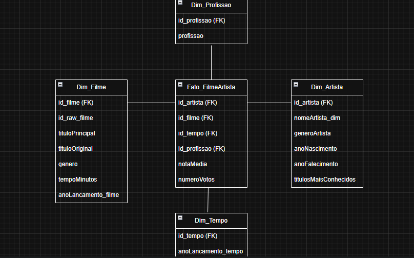
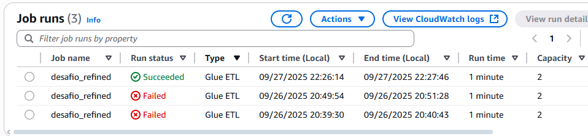
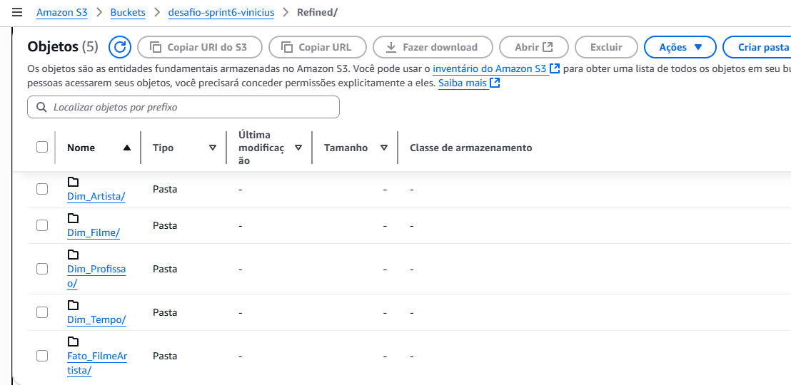
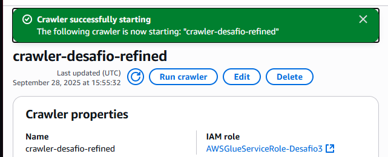
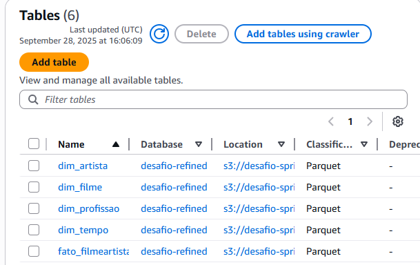
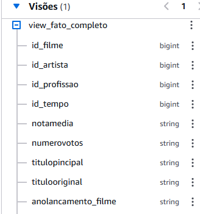

# Desafio da Sprint 7
## Passo-a-passo:
Nesse desafio, era necessário criar um modelo dimensional (utilizei star-schema) para ter uma outra visão das tabelas e colunas de filmes/séries utilizadas. 

Algumas dessas colunas não existiam posteriormente, então tiveram que ser criadas utilizado pyspark no job do Glue, como por exemplo as IDs a serem usadas como foreign keys.
---

## Passo 1:
Testado primeiramente no VSCode, criei o script que seria executado dentro do Glue:

    # código que será executado dentro do glue
    import sys
    from awsglue.transforms import *
    from awsglue.utils import getResolvedOptions
    from pyspark.context import SparkContext
    from awsglue.context import GlueContext
    from awsglue.job import Job
    from pyspark.sql.functions import split, explode, monotonically_increasing_id, col

    ## @params: [JOB_NAME]
    args = getResolvedOptions(sys.argv, ['JOB_NAME'])

    sc = SparkContext()
    glueContext = GlueContext(sc)
    spark = glueContext.spark_session
    job = Job(glueContext)
    job.init(args['JOB_NAME'], args)

    # lendo parquet da camada Trusted
    df = spark.read.parquet(
        "s3://desafio-sprint6-vinicius/Trusted/Local/CSV/Parquet/Movies/2025/09/13/part-00000-33a6e641-bd01-485e-abe1-7dbc2a992b31-c000.snappy.parquet"
    )

    dim_filme = df.select(
        "id", "tituloPincipal", "tituloOriginal", "anoLancamento", "tempoMinutos", "genero"
    ).dropDuplicates()
    dim_filme = dim_filme.withColumn("id_filme", monotonically_increasing_id())

    dim_artista = df.select(
        "nomeArtista", "generoArtista", "anoNascimento", "anoFalecimento"
    ).dropDuplicates()
    dim_artista = dim_artista.withColumn("id_artista", monotonically_increasing_id())

    dim_profissao = df.select("profissao").dropDuplicates()
    dim_profissao = dim_profissao.withColumn("profissao", explode(split("profissao", ",")))
    dim_profissao = dim_profissao.withColumn("id_profissao", monotonically_increasing_id())

    dim_tempo = df.select("anoLancamento").dropDuplicates()
    dim_tempo = dim_tempo.withColumn("id_tempo", monotonically_increasing_id())

    fato_filmeartista = df.select(
        "id", "nomeArtista", "profissao", "notaMedia", "numeroVotos", "anoLancamento"
    )

    # tive problemas com ambiguidade nos nomes das colunas
    dim_filme = dim_filme.withColumnRenamed("id", "id_raw_filme").withColumnRenamed("anoLancamento", "anoLancamento_filme")
    dim_artista = dim_artista.withColumnRenamed("nomeArtista", "nomeArtista_dim")
    dim_profissao = dim_profissao.withColumnRenamed("profissao", "profissao_dim")
    dim_tempo = dim_tempo.withColumnRenamed("anoLancamento", "anoLancamento_tempo")

    fato = (
        fato_filmeartista
        .join(dim_filme, fato_filmeartista.id == dim_filme.id_raw_filme, "left")
        .join(dim_artista, fato_filmeartista.nomeArtista == dim_artista.nomeArtista_dim, "left")
        .join(dim_profissao, fato_filmeartista.profissao == dim_profissao.profissao_dim, "left")
        .join(dim_tempo, fato_filmeartista.anoLancamento == dim_tempo.anoLancamento_tempo, "left")
        .select(
            "id_filme", "id_artista", "id_profissao", "id_tempo",
            "notaMedia", "numeroVotos"
        )
    )

    # escrevendo agora os parquet no S3
    dim_filme.write.mode("overwrite").parquet("s3://desafio-sprint6-vinicius/Refined/Dim_Filme")
    dim_artista.write.mode("overwrite").parquet("s3://desafio-sprint6-vinicius/Refined/Dim_Artista")
    dim_profissao.write.mode("overwrite").parquet("s3://desafio-sprint6-vinicius/Refined/Dim_Profissao")
    dim_tempo.write.mode("overwrite").parquet("s3://desafio-sprint6-vinicius/Refined/Dim_Tempo")
    fato.write.mode("overwrite").parquet("s3://desafio-sprint6-vinicius/Refined/Fato_FilmeArtista")

    job.commit()

Encontrei problemas de redundância, pois algumas tabelas tinham o mesmo nome, como por exemplo "anoLancamento", que estaria presente tanto na tabela Tempo quanto na Filme. Por isso, renomeei as colunas.

Depois de executado o código, a camada Refined estava pronta:

(os erros foram devidos à redundância das tabelas, como mencionei)

## Passo 2:
Com as pastas das tabelas criadas na camada Refined, agora era necessário usar o crawler no Data Catalog para obter os dados de todas as subpastas dessa camada, para criar as tabelas a serem usadas nas consultas do Athena.

Para isso, criei o database que seria o destino dessas tabelas, criei como "desafio-refined".

É válido pontuar que, para o crawler funcionar corretamente, além do database, também tive que incluir o Role do IAM, com permissões para acessar o S3 e o Glue.

Assim, foram criadas as tabelas, e ao clicar em "View Data", o usuário é redirecionado ao Athena.

    CREATE OR REPLACE VIEW view_fato_completo AS
    SELECT 
        f.id_filme,
        f.id_artista,
        f.id_profissao,
        f.id_tempo,
        f.notamedia,
        f.numerovotos,
        d.titulopincipal,
        d.titulooriginal,
        d.anolancamento_filme,
        d.tempominutos,
        d.genero,
        a.nomeartista_dim,
        a.generoartista,
        a.anonascimento,
        a.anofalecimento,
        p.profissao_dim,
        t.anolancamento_tempo
    FROM fato_filmeartista f
    LEFT JOIN dim_filme d 
        ON f.id_filme = d.id_filme
    LEFT JOIN dim_artista a 
        ON f.id_artista = a.id_artista
    LEFT JOIN dim_profissao p 
        ON f.id_profissao = p.id_profissao
    LEFT JOIN dim_tempo t 
        ON f.id_tempo = t.id_tempo;

Com o view criado na query do Athena, é possível acessar todas as informações das tabelas de forma mais prática para as próximas sprints.