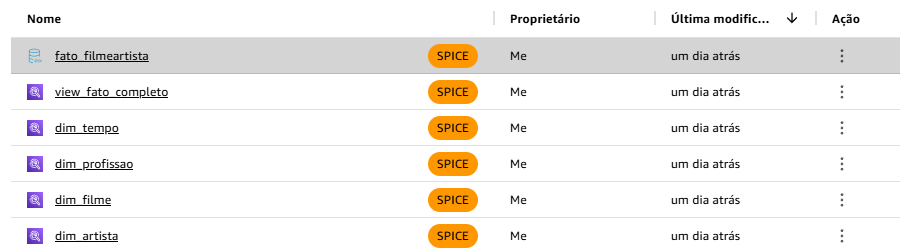
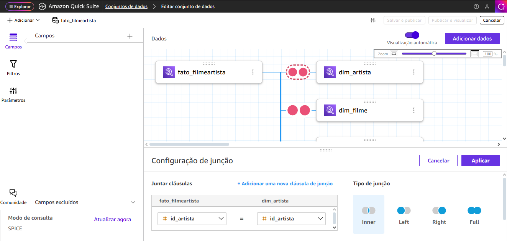
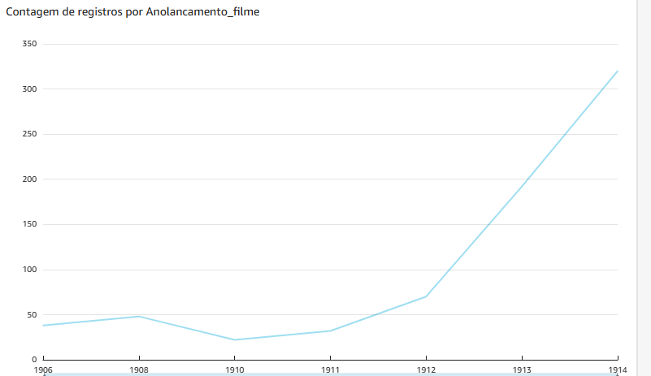
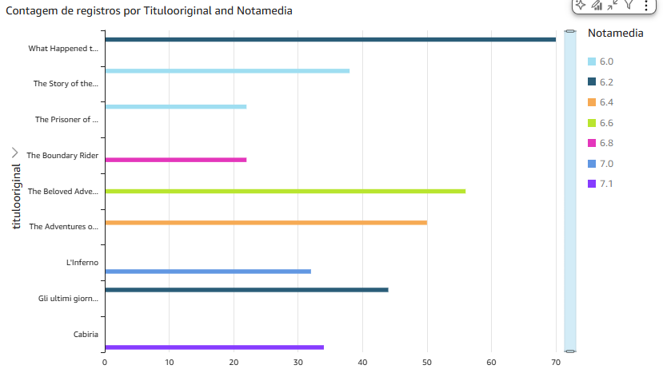
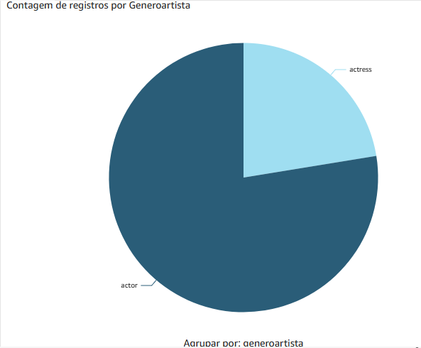

# Resumo do Desafio Final da Sprint 8
---
Nesse desafio, de forma atípica, não produzi nenhum código. Isso porque todo o processo foi feito dentro do QuickSight, usando os filtros e ferramentas da plataforma.
  
Me deparei com um problema ao realizar o desafio, devido a uma mudança no próprio site do serviço. No dia 9 de outubro, o QuickSight foi integrado ao Quick Suite, uma plataforma unificada de Business Intelligence e IA. Dessa forma, agora o QuickSight faz parte dessa plataforma maior, com um layout diferente do anterior QuickSight e, portanto, tive problemas em aprender essa nova disposição de funções, com remapeamento de botões e ferramentas.

---
### Passo 1:
O primeiro passo foi fazer com que o QuickSight tivesse acesso ao S3 e ao Athena, para acessar as tabelas da camada Refined através dos roles do IAM. Em seguida, criei os datasets através das tabelas disponíveis no Athena (utilizado como fonte de dados/data source), que vieram do S3 através do Crawler, também na Sprint passada.

Tendo acessados esses dados, pude editar o Data Prep da tabela fato_filmeartista, para poder realizar os devidos joins com as demais tabelas.

Configurei a condição de que os IDs das tabelas sejam iguais aos IDs da tabela fato (fato_filmeartista.id_filme = dim_filme.id_filme), e realizei o inner join, que compara essas duas colunas das duas tabelas. Fiz o mesmo com todas as outras tabelas em relação à fato.

### Passo 2:
Tendo criado esse dataset com todas as tabelas integradas, pude então partir para a análise dos dados através dos painéis/dashboards do QuickSight. Porém, depois de algumas dificuldades, decidi mudar as análises que eu tinha estabelecido na Sprint 5.

---
#### Primeira Análise: 
O início do cinema mudo foi no fim dos anos 1800 e deu seus primeiros passos no início de 1900.

Mas entre 1914-1918, aconteceu a Primeira Guerra Mundial. <b>Como esses eventos impactaram a indústria do cinema?</b>

#### Contexto:
É perceptível que às margens da data da Primeira Guerra, a quantidade de filmes lançados aumentou incansavelmente. Isso, provavelmente porque, com os conflitos sendo instaurados entre os países europeus, os Estados Unidos, por estarem fora de toda essa zona, tiveram maior espaço e tempo disponível no mercado. 

Além disso, vale lembrar que o cinema se consolidou nessa época como um entretenimento necessário e de alta demanda na sociedade, sendo consumido tanto por soldados como por civis comuns.

#### Segunda análise:
Como o cinema estava dando seus primeiros passos, ainda na época dos filmes mudos, <b>quais são os filmes com maiores notas médias na época?</b>

Nesse gráfico de barras, filtrei os filmes apenas de nota 6 ou superior.

É possível notar que, mesmo entre os mais bem avaliados, a maior nota foi de 7.1, do seriado "What Happened to Mary". O filme do famoso Robin Hood, nem sequer esteve entre esses filmes com maior nota. 

É obvio que, pela indústria estar começando, ainda não haviam as técnicas e tecnologias utilizadas em filmes modernos, e isso reflete na nota.

#### Terceira análise:
Naquela época o espaço das atrizes era quase inexistente numa indústria majoritariamente masculino,  assim como ainda é no mercado. Mas, ainda assim algumas atrizes se destacavam.

<b>Qual era a diferença entre os gêneros nessa indústria?</b>

No gráfico de pizza, fica clara essa diferença de espaço, onde existiam muito mais atores do que atrizes. No dataset em que analisei, o registro é de 560 homens, e somente em volta de 160 mulheres.

O interessante é que, ainda assim, uma das estrelas pioneiras do cinema era Mary Fuller, que interpreta a personagem Mary no seriado citado acima "What Happened to Mary" de 1912. O seriado foi tão bem sucedido na época, que foi lançado um filme de ação como sequência, chamado "Who Will Marry Mary" de 1913, onde a atriz voltou a interpretar o seu personagem.

