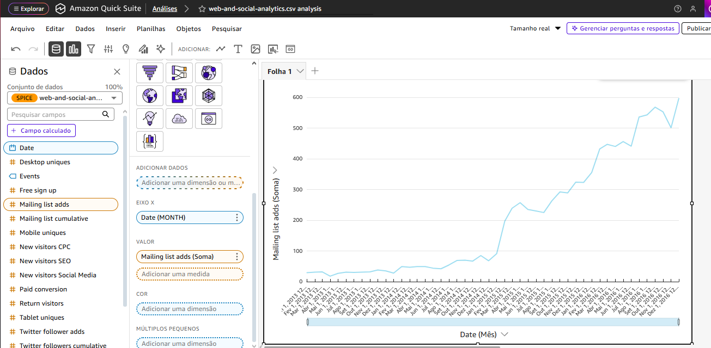

# Resumo Sprint 8
## O que foi feito até aqui?
Nessa Sprint foram utilizados cursos de AWS QuickSight na Udemy e no AWS Skill Builder, pois essa ferramenta seria utilizada durante o desafio. Vale frisar que o QuickSight agora é uma ferramenta integrada ao Quick Suite, plataforma de Business Intelligence e IA. (desde o dia 9 de Outubro)

A Sprint 8 foi a última etapa do desafio Filmes e Séries que teve início na Sprint 5. Para chegar ao fim do desafio, é necessário relembrar o que foi feito até aqui.

### Sprint 5:
O desafio teve início na Sprint 5, onde foram definidas análises a serem feitas, que no fim eu acabei mudando por conta de alguns erros no meu QuickSight. Além disso, nessa Sprint foram instalados os arquivos .csv relativos aos filmes e séries e salvos num bucket do S3. O mesmo foi feito com uma API do The Movies DataBase (TMDB), em .json num mesmo bucket, na camada Raw.

### Sprint 6:
Em seguida, esses arquivos do S3 foram tratados em um ETL no AWS Glue. Filtrei assim os gêneros dos filmes, uma vez que ao meu squad foi designado 'Ação e Aventura', e limitei a somente 100 registros. Os dados tratados foram salvos em uma nova camada Trusted no S3, em formato parquet.

### Sprint 7:
Nessa Sprint, por sua vez, seriam utilizados esses dados para criar tabelas salvas agora na camada Refined no S3, dessa maneira, o Crawler seria usado para percorrer essas informações e armazená-las no Data Lake que seria acessado pelo Athena.

Acessando os dados pelo Athena, foi possível realizar consultas (queries) desses dados e criar um view, realizando os joins dessas tabelas na tabela fato, para que o acesso da próxima Sprint fosse facilitado.

### Sprint 8:
Além dos cursos, também foi feito o laboratório do AWS Quick Sight, onde foi ensinado sobre os conceitos e também um breve exercício prático. Nele, deveria ser realizado o upload de um conjunto de dados fornecidos no Udemy e realizadas algumas análises a partir dele.

Chegando agora ao fim do desafio, todos esses dados foram acessados pelo QuickSight, usando o Athena como fonte de dados.
Essas tabelas foram então utilizadas em dashboards para responder às análises estabelecidades previamente.

Não foram gerados nenhum código nessa Sprint, pois todo o processo foi feito diretamente no QuickSight. Todos os screenshots referentes ao que foi feito estão disponíveis na pasta Evidências abaixo.

- [Pasta Evidências](../Sprint08/Evidências/)
- [Pasta Desafio](../Sprint08/Desafio/)
- [Readme do Desafio](../Sprint08/Desafio/README.md)